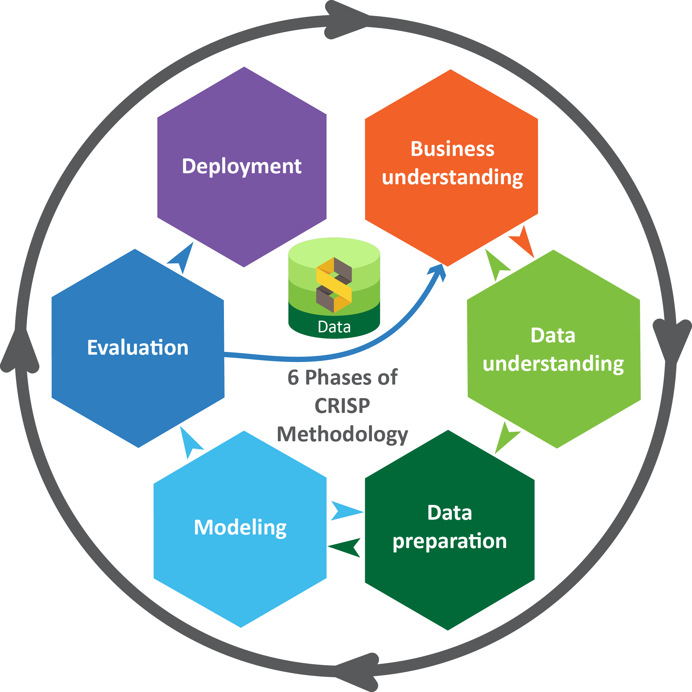
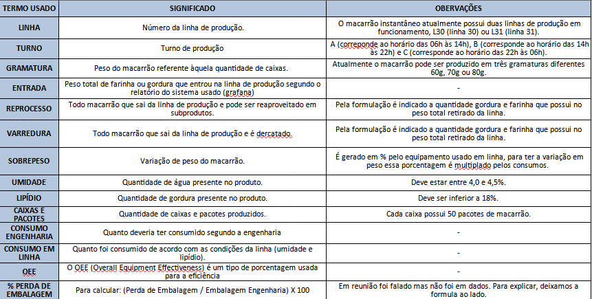
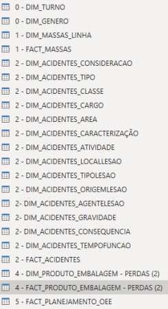
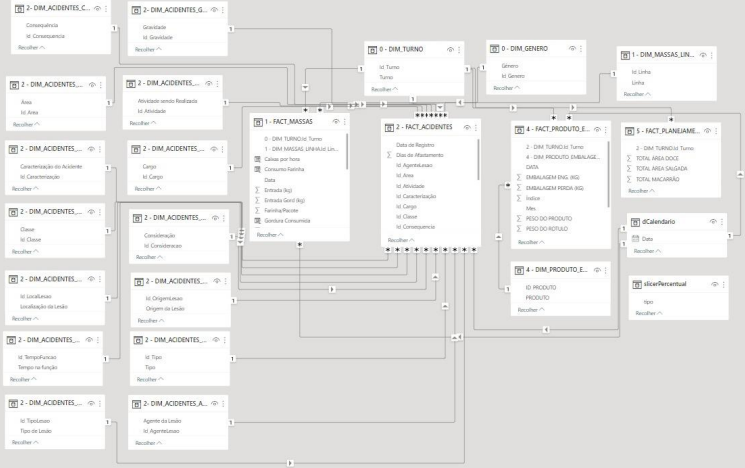
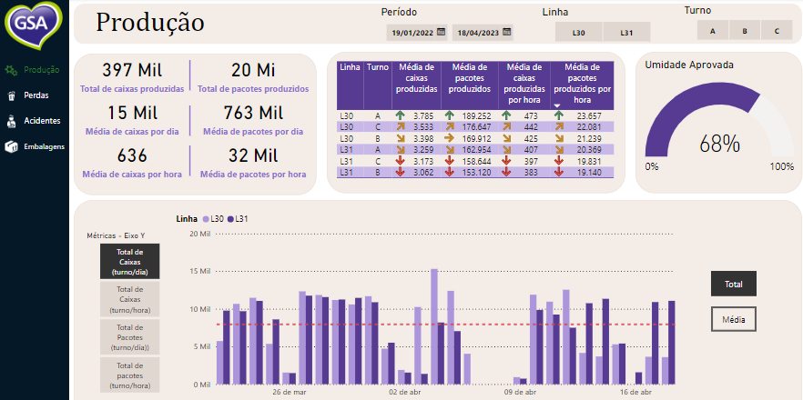
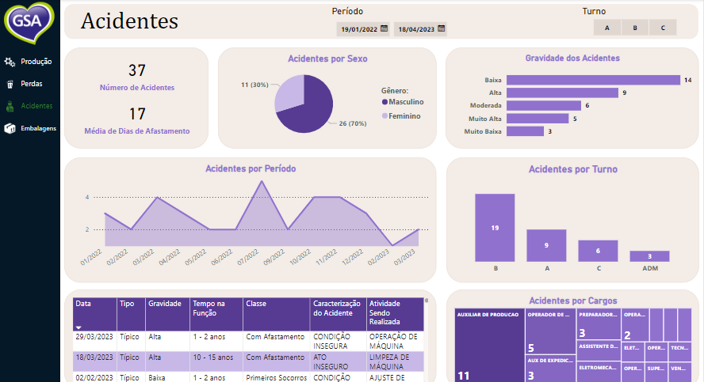
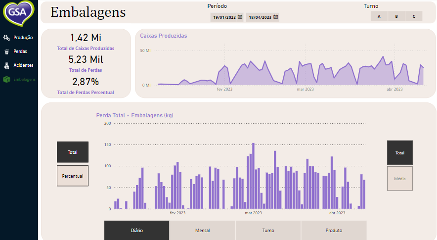

# Dashboard: Indústria do ramo alimentício
 Criação de dashboard operacional para a empresa GSA. 

## 👉 Dados da Empresa

**Nome da Empresa:** GSA Alimentos

**Quantidade de Funcionários:** 501 - 1000

**Segmento:** Serviços de alimentos e bebidas

**Site | Linkedin:** [https://www.linkedin.com/company/grupogsaalimentos](https://www.linkedin.com/company/grupogsaalimentos/)

> **Expectativa da Empresa:** Que seja uma dashboard prática, de fácil entendimento e preenchimento, e que ela ajude no acompanhamento dos indicadores e na tomada de decisões pelo time e liderança.

## 1. Contextualização

GSA é uma indústria de alimentos que possui muitos SKU's e que ainda possui muito processo manual, principalmente no que diz respeito à gestão. No setor de produção, é imprescindível o acompanhamento de quantidade de acidentes, perdas da produção e da eficiência dos processos. Então para mitigar os problemas de desperdício, acidentes e melhorar a eficiência, eles precisam de uma ferramenta mais objetiva e rápida, pois é importante ter uma consulta ágil dos indicadores por conta da dinâmica da operação.

Com base nisso, foi utilizado a metodologia Cross Industry Standard Process for Data Mining (CRISP-DM) para a elaboração desse projeto.
 

## 2. Base de dados

Dicionário dos termos utilizados:

  

Caso fique difícil de visualizar, clique [aqui](https://github.com/gcesarmelo7/powerBI_GSAcompany/blob/main/images/dicionario_2.png).

## 3. Business Understanding/Data Understanding

- **Resumo:** Setor de produção de macarrão instantâneo com 220 SKUs (Linha de Massas) – 2 linhas dedicadas, com a 3ª prestes a ser iniciada. Informações são coletadas diária e mensalmente.

- **Quantas pessoas há na área:** 300 pessoas em chão de fábrica, com 3 turnos. Seis pessoas no departamento de controle

- **O problema:** Geração de custos no processo por conta de perdas e acidentes do processo

- **A empresa já está realizando alguma ação para resolver o problema:** Anteriormente, esse acompanhamento dos indicadores era feita por gestão a vista, porém era um painel difícil e nada prático para o time consultar e preencher.

- **Principais métricas e indicadores referentes ao projeto:**
  
    - Sobrepeso;
    - Controle inventário;
    - Controle commodities - açúcar, farinha, gordura;
    - % Gordura e %Umidade produto final;
    - Varredura (resíduo produção);
    - % Perda de Embalagens;
    - OEE;
    - Produção (planej vs realizado);
    - Perdas (planej vs real);
    - Quantidade de acidentes
      
- **Ferramentas utilizadas para armazenar as métricas/indicadores:** Excel/Google Sheets e SAP

- **Os dados ficam centralizados na área:** PCP

## 4. Data Preparation

Durante a etapa de formatação dos dados, realizou-se transformações sintáticas nos dados, mantendo o significado original, mas adaptando-os para atender
aos requisitos da ferramenta de modelagem utilizada, que no nosso caso foi o PowerBI. Utilizou-se a *linguagem M*, que é a linguagem de fórmula do Power Query no
Power BI, para realizar essas transformações e formatações nos dados.

Durante essa etapa, criamos tabelas DIM (dimensionais) e tabelas FACT (fatos)
para cada planilha de origem dos dados. Essa abordagem segue o modelo de estrela
(star schema), que é um modelo de banco de dados comumente utilizado para projetar
esquemas dimensionais em data warehouses. 

No modelo de estrela, as tabelas DIM
contêm informações descritivas, enquanto as tabelas FACT contêm medidas
numéricas e chaves estrangeiras para as tabelas DIM. Essa estrutura de tabelas
interconectadas evita a replicação de informações e permite uma análise eficiente e
consistente dos dados.

Link [aqui](https://github.com/gcesarmelo7/powerBI_GSAcompany/blob/main/images/dim_fact.png).

Utilizou-se o modelo de estrela (star-schema) para organizar as tabelas DIM e FACT. Esse modelo nos permitiu relacionar
as informações de diferentes tabelas de forma estruturada, evitando a replicação de
dados e simplificando os relacionamentos entre elas.

A chave de turno foi uma das principais chaves que utilizamos para relacionar
as tabelas DIM e FACT no modelo de estrela. Isso garantiu a integridade das
informações e facilitou uma análise multidimensional coerente no Dashboard.

Em resumo, a formatação dos dados seguiu o modelo de estrela, com tabelas
DIM e FACT interligadas. Isso proporcionou uma estrutura organizada para a análise
dos dados no Dashboard, evitando duplicações e permitindo uma visão abrangente
das informações. Ajustou-se o formato dos dados para atender aos requisitos da
ferramenta de modelagem, garantindo que as operações e análises pudessem ser
realizadas de forma adequada.

Link [aqui](https://github.com/gcesarmelo7/powerBI_GSAcompany/blob/main/images/schema_BI.png).

## 5. Data Visualization

Dessa forma, na etapa final, foi realizado a construção do dashboard final proposto, obtendo-se como resultado final as abas:

### Produção :bar_chart:

### Perdas :bar_chart:

### Acidentes :bar_chart:

### Embalagens :bar_chart:
/>

O sponsor agora pode navegar por essas páginas conforme sua necessidade, obtendo **insights e possíveis melhorias** a serem consideradas com os dados já organizados e prontos para uso.

